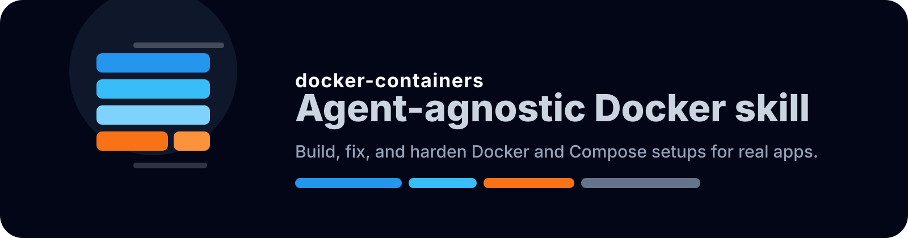
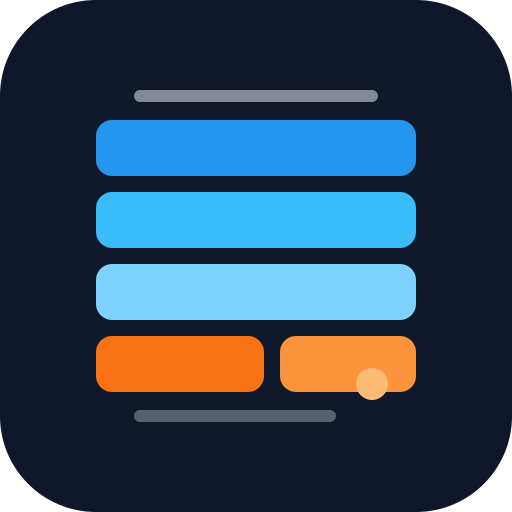

# docker-containers

<p align="center">
  
</p>

`docker-containers` is an agent-agnostic skill for building, fixing, and hardening Docker setups for real apps. It is designed for agents that load local skill folders, including Codex, Claude Code, Warp, Antigravity, Gemini CLI, Cursor, GitHub Copilot, and OpenCode.

<p align="center">
  
  
  
</p>

<p align="center">
  
</p>

Use it when you want an agent to handle the repetitive parts of container work correctly on the first pass: `Dockerfile`, `.dockerignore`, Compose, startup commands, image size, caching, ports, volumes, and container debugging.

## More Awesome Collections For Developers

- Claude Code Subagents
- Codex Subagents
- OpenClaw Skills
- AI Agent Papers

## Follow

- X: [@mdayan24X](https://x.com/mdayan24X)

## Table of Contents

- [Compatibility](#compatibility)
- [What It Covers](#what-it-covers)
- [More Awesome Collections For Developers](#more-awesome-collections-for-developers)
- [Follow](#follow)
- [Install](#install)
- [Example Requests](#example-requests)
- [Repository Structure](#repository-structure)
- [Contributing](#contributing)
- [License](#license)
- [Security Note](#security-note)

## Compatibility

| Agent | Common skill path | Notes |
| --- | --- | --- |
| Antigravity | `.agent/skills/` | Matches the skill folder layout used by Antigravity-style local skills. |
| Claude Code | `.claude/skills/` | Works as a local Claude Code skill. |
| Codex | `.codex/skills/` | Works in the Codex local skills directory. |
| Cursor | `.cursor/skills/` | Works as a local Cursor skill. |
| Gemini CLI | `.gemini/skills/` | Works as a local Gemini CLI skill. |
| GitHub Copilot | `.github/skills/` | Works as a local Copilot skill. |
| OpenCode | `.opencode/skills/` | Works as a local OpenCode skill. |
| Warp | `.agents/skills/`, `.warp/skills/`, `.claude/skills/`, `.codex/skills/`, `.cursor/skills/`, `.gemini/skills/`, `.copilot/skills/`, `.factory/skills/`, `.github/skills/`, `.opencode/skills/` | Warp can discover skills from several project-local paths. |

If your agent uses a different folder, point it to the repo with the install command below and set `SKILLS_DIR` accordingly.

## What It Covers

- containerizing Node, Python, Go, and frontend apps
- adding Postgres, Redis, or other services with Compose
- fixing broken Docker builds and startup failures
- shrinking images and improving cache behavior
- making a container setup safer for production

The skill stays narrow on purpose:

- it does not invent Kubernetes unless the task needs Kubernetes
- it does not add extra layers or tools unless they solve a real problem
- it keeps changes reviewable and easy to undo
- it preserves the app's current run behavior unless the request says otherwise

## Install

Set `SKILLS_DIR` to the folder your agent uses for skills, then run this once:

```bash
SKILLS_DIR="${SKILLS_DIR:-$HOME/.codex/skills}" && mkdir -p "$SKILLS_DIR" && git clone https://github.com/mdayan8/docker-containers.git "$SKILLS_DIR/docker-containers"
```

If your agent uses a different skill directory, change `SKILLS_DIR` to that path.

## Example Requests

Use the skill for requests like:

- `Containerize this Node app and add Compose for Postgres`
- `My Docker build is slow; make it smaller and faster`
- `Fix this container startup failure and tell me why it exits`
- `Add Redis to my Compose file and wire the app to it correctly`
- `Make this Docker setup production-safe without changing app behavior`

## Repository Structure

- `SKILL.md` contains the trigger rules and workflow
- `agents/openai.yaml` contains the UI-facing metadata used by Codex-style tooling
- `references/examples.md` contains concrete Dockerfile and Compose starters
- `references/recipes.md` contains stack-specific patterns
- `references/troubleshooting.md` contains common failure modes and fixes

## Contributing

Keep changes small and specific.

- add new guidance only when it helps the skill make better Docker decisions repeatedly
- prefer concrete examples over broad theory
- keep the README human-readable and easy to scan
- keep the skill focused on Docker and Compose rather than platform sprawl

## License

MIT License.

## Security Note

This repository is meant to be reviewed before use in production environments.
Container skills can influence build commands, environment handling, and runtime defaults, so treat them as operational code rather than decorative documentation.
